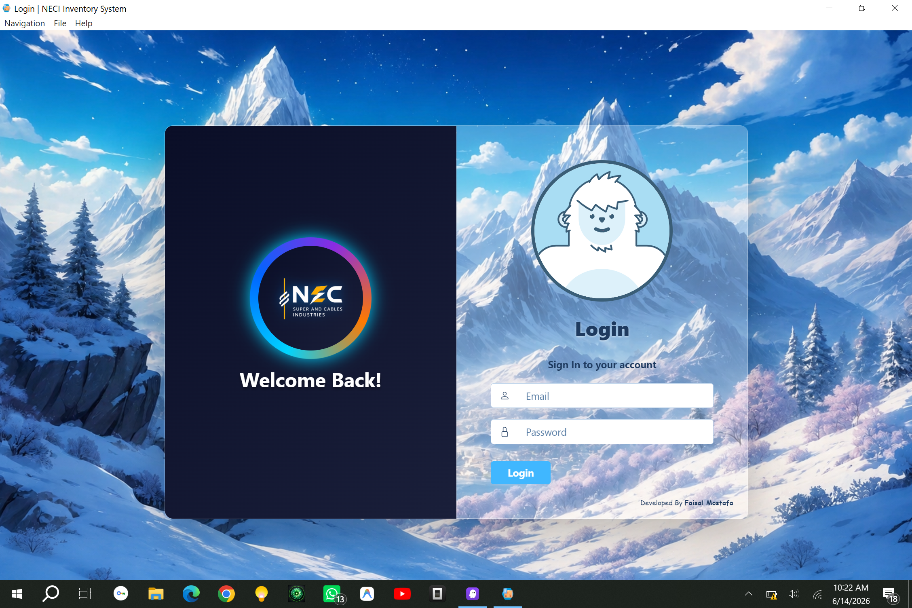
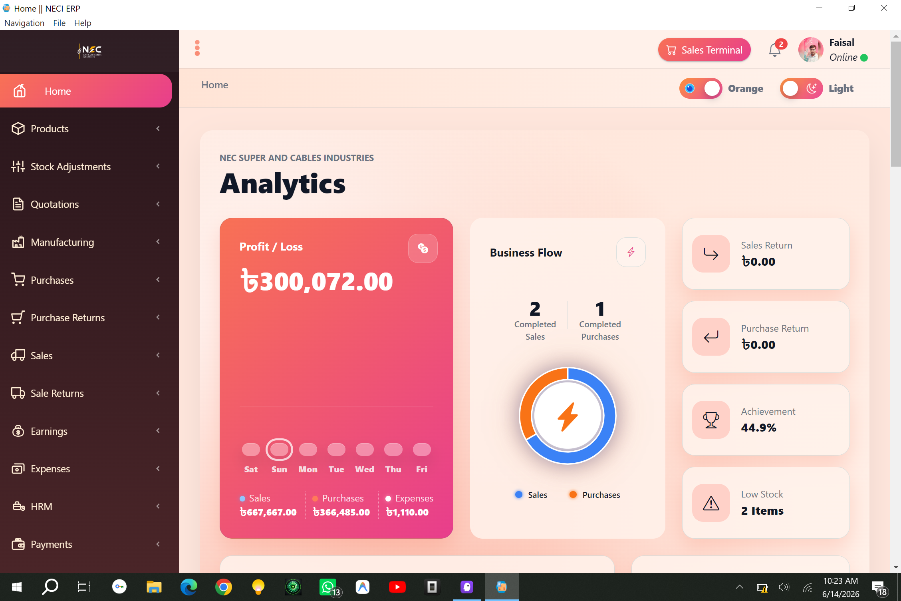

# Industrial ERP System

A full-featured desktop ERP application for industrial businesses — built with **Laravel + Electron + SQLite**. Runs entirely offline on Windows. No server, no cloud, no subscription.

<div align="center">

[](https://RAILWAY_URL_HERE)
[](https://github.com/faisalmoastafa/Industrial-ERP-Enterprise-resource-planning-Software/releases/latest)

</div>

---

## Screenshots

<p align="center">
  
  &nbsp;
  
</p>

---

## Live Demo

🌐 **[Try the live demo on Railway →](https://RAILWAY_URL_HERE)**

| Field | Value |
|---|---|
| Email | `demo@neci-erp.com` |
| Password | `demo1234` |

> Demo resets periodically. Data you enter may be cleared.

---

## Download & Install (Windows)

💾 **[Download the latest installer (.exe) →](https://github.com/faisalmoastafa/Industrial-ERP-Enterprise-resource-planning-Software/releases/latest)**

1. Download `NECI-ERP-Setup.exe` from the link above
2. Run the installer (click **Yes** if Windows asks for permission)
3. Launch **NECI ERP** from your desktop
4. Login with: `superadmin@erp.com` / `superadmin`

> No internet required. Runs fully offline on Windows 10/11.

---

## What's Included

| Module | Features |
|---|---|
| Products & Inventory | Products, categories, barcodes, stock levels |
| Purchases | Supplier orders, payments, purchase returns |
| Sales & Billing | Invoices, POS, sale returns, PDF printing |
| Quotations | Price quotes with one-click conversion to sale |
| Customers & Suppliers | Profiles, ledger, opening balances |
| Expenses & Income | Categorized financial entries |
| Manufacturing | Production batches, raw material consumption |
| HRM & Payroll | Employees, attendance, overtime, bonuses, payroll |
| Reports | Profit & Loss, stock, cash flow, and more |
| Settings | Branding, logo, currency, units |
| User Management | Roles, permissions, activity log |
| Backup & Restore | One-click SQLite backup with restore |

---

## Default Login

| Field | Value |
|---|---|
| Email | `superadmin@erp.com` |
| Password | `superadmin` |
| Role | Super Admin (full access) |

> **Change the password** immediately after first login.

---

## Requirements (to build from source)

- **Windows 10/11** (64-bit)
- **Node.js** v18+ — [nodejs.org](https://nodejs.org)
- **PHP 8.3 for Windows** — download `php-8.3.x-Win32-vs16-x64.zip` from [windows.php.net](https://windows.php.net/download/) and extract it to:
  ```
  Industrial-ERP-Software\php-8.3.31-Win32-vs16-x64\
  ```

> PHP is not included in the repo because of GitHub's 100MB file size limit.

---

## How to Build the Installer

### Step 1 — Clone the repo

```bash
git clone https://github.com/faisalmoastafa/Industrial-ERP-Enterprise-resource-planning-Software.git
```

### Step 2 — Install PHP

Download PHP 8.3 (Thread Safe, x64) from [windows.php.net](https://windows.php.net/download/) and extract to:
```
Industrial-ERP-Software\php-8.3.31-Win32-vs16-x64\
```

Copy `Industrial-ERP-Software\build-files\php.ini` into the PHP folder.

### Step 3 — Install Laravel dependencies

```bash
composer install --no-dev --optimize-autoloader
```

### Step 4 — Run the build

Double-click `Industrial-ERP-Software\build.bat` (or run as Administrator).

---

## Tech Stack

- **Backend**: Laravel 10, PHP 8.3, SQLite
- **Frontend**: Blade templates, Livewire, Alpine.js, Vite
- **Desktop shell**: Electron 28
- **Key packages**: Spatie Permissions, Spatie MediaLibrary, Laravel Modules, Yajra DataTables, Maatwebsite Excel, Milon Barcode

---

## License

MIT — free to use, modify, and distribute.
